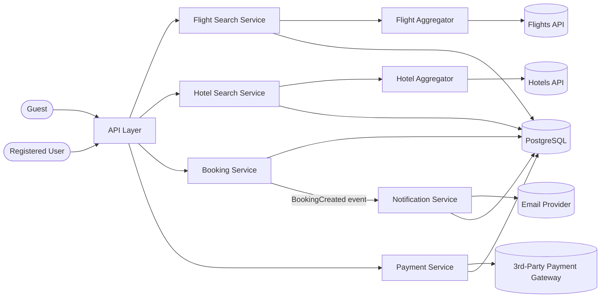

# Booking Project

Hotels & Flights booking system.

## Structure

```
Booking/
├── use-cases.md          # Use case list: actors, use cases, groupings
├── system-design.md      # Basic system design (high-level architecture)
├── caching-design.md     # Search caching design (Guest vs Logged-in)
├── concepts.md           # Scatter & Gather / Redis — background + how they're used here
├── open-questions.md     # Unresolved database design decisions
├── sources/
│   ├── use-case-diagram.jpg   # Original hand-drawn use-case diagram (source of truth for use-cases.md)
│   ├── session-2-tasks.png    # Task list for session 2
│   └── schema.dbml            # Database schema (PostgreSQL, DBML format)
└── diagrams/
    └── UC-01 .. UC-12         # One file per use case
```

## Task 1 — Use Cases

[`use-cases.md`](use-cases.md) lists 12 use cases (UC-01–UC-12) derived from
the source diagram below ([`sources/use-case-diagram.jpg`](sources/use-case-diagram.jpg)),
covering three actors (**Guest**, **Registered User**, **System**) across
three areas: Search & Filter, Booking, and Payment.


## Task 2 — Flowchart, Sequence Diagram, Pseudocode, Entity Relationships

Each file in `diagrams/` covers one use case with four sections:

- **Flowchart** — step-by-step logic
- **Sequence Diagram** — actor/system/external-service interaction over time
- **Pseudocode** — the endpoint's logic
- **Entity-Relationship Diagram** — the tables involved, from [`sources/schema.dbml`](sources/schema.dbml)

| # | Use Case |
|---|---|
| UC-01 | [Search Hotels](diagrams/UC-01-search-hotels.md) |
| UC-02 | [Filter Hotels](diagrams/UC-02-filter-hotels.md) |
| UC-03 | [Search Flights](diagrams/UC-03-search-flights.md) |
| UC-04 | [Filter Flights](diagrams/UC-04-filter-flights.md) |
| UC-05 | [Initiate Payment](diagrams/UC-05-initiate-payment.md) |
| UC-06 | [Verify Payment Status](diagrams/UC-06-verify-payment-status.md) |
| UC-07 | [Book Hotel](diagrams/UC-07-book-hotel.md) |
| UC-08 | [Retrieve Booking History](diagrams/UC-08-retrieve-booking-history.md) |
| UC-09 | [Cancel Booking](diagrams/UC-09-cancel-booking.md) |
| UC-10 | [Retrieve Booking Details](diagrams/UC-10-retrieve-booking-details.md) |
| UC-11 | [Book Flight](diagrams/UC-11-book-flight.md) |
| UC-12 | [Send Confirmation Email](diagrams/UC-12-send-confirmation-email.md) |

## Database Design

[`sources/schema.dbml`](sources/schema.dbml) covers every table needed to
support the 12 use cases above (Users & Auth, Customer Management, Booking,
Payment, Notification, Search & Filter). It is structurally complete for this
scope, but 8 design decisions are still open — see [`open-questions.md`](open-questions.md):

1. Is `transaction.currency` required?
2. How is a refund modeled on cancellation (new row vs. status update)?
3. Is seat-number selection in scope for flight booking?
4. Which real provider does the Flight Aggregator call (Duffel is a candidate)?
5. What transport carries Scatter & Gather's partial response (polling vs. SSE)?
6. Can one `transaction` cover both a `flight_booking` and a `hotel_booking` (package deal)?
7. Is a per-provider cache worth the added aggregation complexity?
8. Is proactive cache refresh before TTL expiry worth adding?

Rating/Review is out of scope for this project at this stage — no use case
currently requires it.

Traveller/guest data on a booking (`flight_booking.travellers`,
`hotel_booking.travellers`) is a settled decision, not an open question: a
`jsonb` column instead of a separate table — see the "Traveller data" section
in [`concepts.md`](concepts.md) (2026-09-19).

## Session 2

Task source: [`sources/session-2-tasks.png`](sources/session-2-tasks.png)

### Basic System Design — Booking

[`system-design.md`](system-design.md) — high-level architecture: 7
components (Flight Search, Hotel Search, their two Aggregators, Booking,
Payment, Notification — Search was split into two services on 2026-08-30,
and an Aggregator layer was added in front of each provider API the same
day; see the Decision notes in `system-design.md`), the external systems
each one talks to, and how the 12 use cases map onto them.



### Cache Flights or Hotel Task

[`caching-design.md`](caching-design.md) — caching strategy for Search
(UC-01–UC-04): each user/guest gets their own cache row, keyed by their
identity (a session `userId`, or a cookie-based `guestId` for anonymous
users — 2026-09-19) plus the search criteria, not one row shared by
everyone with the same search — that shared-key shape risked a "thundering
herd" of simultaneous provider calls when its TTL expired. Logged-in users
additionally get results re-ranked using their booking history. Applied to
[UC-01](diagrams/UC-01-search-hotels.md),
[UC-02](diagrams/UC-02-filter-hotels.md), [UC-03](diagrams/UC-03-search-flights.md),
[UC-04](diagrams/UC-04-filter-flights.md).

### Reading — Scatter & Gather / Redis / Traveller data modeling

[`concepts.md`](concepts.md) — explains Scatter & Gather, Redis caching, and
the JSONB-vs-table decision for traveller data, and exactly how (and where)
each one is used in this project, for interview prep.

### Scatter & Gather — PoC (session 21 task)

[`poc/scatter-gather/`](poc/scatter-gather/) — a small runnable Node.js PoC
(static/mock providers, no real HTTP) demonstrating Scatter, per-provider
Timeout, Retry, and Resilience live. Run with `node poc/scatter-gather`. See
its own [README](poc/scatter-gather/README.md) for what it shows and what it
deliberately leaves open (the Partial Response transport — see
`open-questions.md` #5).
