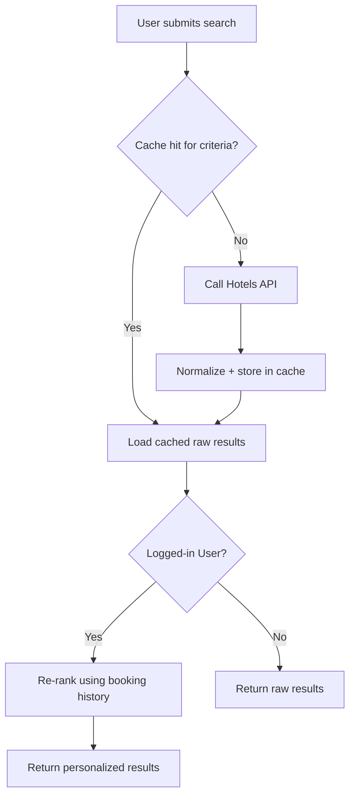

# Cache Flights or Hotel — Design

**Source:** `sources/session-2-tasks.png` — "Cache Flights or Hotel Task:
Guest User ==> Caching / Logged in User ==> Caching". The source names the
two cases but does not explain the difference between them — the design
below is a proposal, not a transcription. Everything not directly stated in
the source is marked **[مقترح]**.

## The problem

UC-01/UC-03 (Search) and UC-02/UC-04 (Filter) currently call the
Hotels/Flights API on every request. If many users search the same
criteria in a short window, that's redundant external calls.

## Proposed design [مقترح]

**Shared layer — same for Guest and Logged-in:**
Raw results from the Hotels/Flights API depend only on the search criteria
(origin, destination, date, passengers / city, checkIn, checkOut, guests) —
not on who's asking. So the raw API response is cached once, keyed by the
search criteria, and reused by **any** user (Guest or Logged-in) who submits
the same search.

```
cacheKey = "search:{hotel|flight}:" + hash(criteria)
```

**Where Guest and Logged-in differ [مقترح]:**
A Logged-in User has booking history in `flight_booking` / `hotel_booking`
(linked via `customerId`). The proposal is to apply a **personalization step
on top of the shared cached results** — e.g. ranking results the customer
has booked from before higher — computed per request, not itself cached
long-term (it depends on the individual customer, so caching it would not
be reusable the way the raw results are).

| | Guest | Logged-in User |
|---|---|---|
| Raw API results | shared cache, keyed by criteria | same shared cache entry |
| Personalization | none — returns raw cached results | re-ranks cached results using this customer's booking history |

## Open items [مقترح — not decided]

- **Cache technology:** the source's "Reading" list names Redis, so Redis is
  proposed, but this isn't stated as a requirement.
- **TTL (expiry time):** not stated anywhere in the source. A reasonable
  default needs to be picked — proposing **5 minutes** as a starting point.
- **Cache invalidation:** not addressed — e.g. if a hotel's availability
  changes mid-window, the cache would serve stale data until it expires.

## Updated flow (Search Hotels example)


