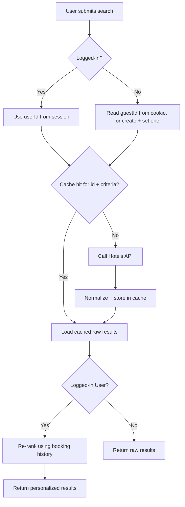

# Cache Flights or Hotel — Design

**Source:** `sources/session-2-tasks.png` — "Cache Flights or Hotel Task:
Guest User ==> Caching / Logged in User ==> Caching". The source names the
two cases but does not explain the difference between them — the design
below is a proposal, not a transcription. Everything not directly stated in
the source is marked **[مقترح]**.

## The problem

UC-01/UC-03 (Search) and UC-02/UC-04 (Filter) currently call the
Hotels/Flights API on every request. If many users search the same
criteria in a short window, that's redundant external calls.

## Proposed design [مقترح]

**Cache key (updated 2026-09-19):**

```
cacheKey = "search:{hotel|flight}:" + (userId | guestId) + ":" + hash(criteria)
```

Earlier version of this doc keyed the cache by `hash(criteria)` alone,
shared across every user searching the same thing. That has a real failure
mode: if many users search identical criteria around the same time, they
all share one cache row with one TTL — so when it expires, all of them miss
at once and hit the Hotels/Flights API simultaneously (a "thundering herd" /
cache stampede), which can burn through a provider's rate limit in a single
spike instead of the steady trickle caching is supposed to produce.

Including the requester's identity in the key gives each user their own
cache row with a TTL that starts from *their* request time, so expiries
land at different moments instead of all together — spreading the load
instead of concentrating it. **This reduces the risk, it does not eliminate
it**: if a large enough number of *different* users happen to search at
close to the same instant, their TTLs still cluster. Two follow-up ideas
were raised but not settled — see `open-questions.md` #7 and #8.

**Identifying a Guest (no login) for this key:**
A Logged-in User already has a `userId` from their session. A Guest doesn't
have an account, so needs an identity assigned to them: a unique id (e.g. a
ULID) generated on first contact and stored in a cookie — not `localStorage`,
because a cookie is sent automatically with every request (no manual
frontend work), is readable server-side, survives a browser restart, and
supports `HttpOnly`/`Secure` flags `localStorage` has no equivalent for.
On each request: if the cookie has a `guestId`, use it; if not, generate one
and set it in the response. `IP address` was considered and rejected as an
identifier — it's shared across users on the same network and can change
mid-session for one user (e.g. switching wifi to mobile data).

**Where Guest and Logged-in differ [مقترح]:**
Both get their own cache row now (own id + criteria hash — see the cache
key section above), not one entry shared across every user. A Logged-in
User's row is additionally eligible for a **personalization step**: results
re-ranked using their booking history in `flight_booking` / `hotel_booking`
(linked via `customerId`), computed per request on top of the cached raw
provider results — not itself cached long-term, since it's specific to one
customer and wouldn't be reusable the way the raw results are.

| | Guest | Logged-in User |
|---|---|---|
| Cache key identity | `guestId` from cookie | `userId` from session |
| Raw API results | own cache row (guestId + criteria) | own cache row (userId + criteria) |
| Personalization | none — returns raw cached results | re-ranks cached results using this customer's booking history |

## Open items [مقترح — not decided]

- **Cache technology:** the source's "Reading" list names Redis, so Redis is
  proposed, but this isn't stated as a requirement.
- **TTL (expiry time):** not stated anywhere in the source. A reasonable
  default needs to be picked — proposing **5 minutes** as a starting point.
- **Cache invalidation:** not addressed — e.g. if a hotel's availability
  changes mid-window, the cache would serve stale data until it expires.

## Updated flow (Search Hotels example)


