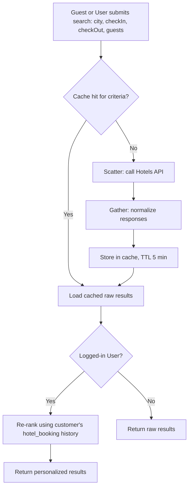
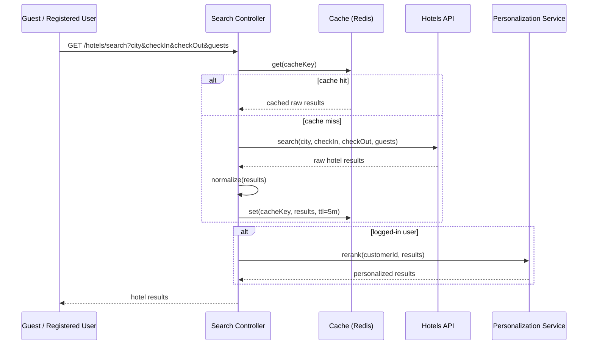
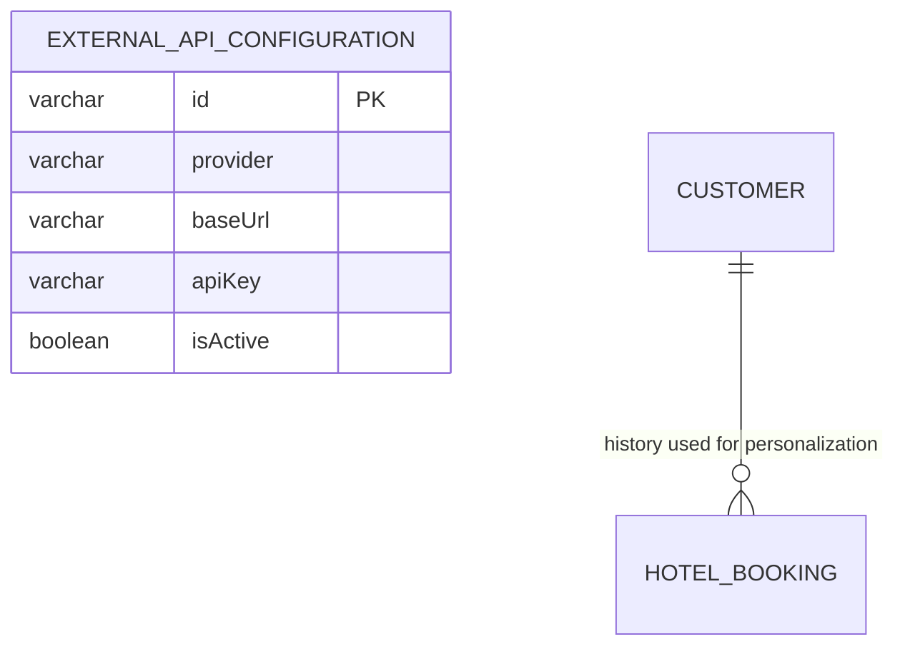

# UC-01 — Search Hotels

**Actor:** Guest
**Team:** Moaz, Radwa

Caching behavior below follows [`caching-design.md`](../caching-design.md)
[مقترح].

## Flowchart



## Sequence Diagram



## Pseudocode

```
function searchHotels(city, checkIn, checkOut, guests, customerId):
    cacheKey = buildCacheKey("hotel", city, checkIn, checkOut, guests)
    results = cache.get(cacheKey)

    if results is null:
        raw = HotelsAPI.search(city, checkIn, checkOut, guests)
        results = normalize(raw)
        cache.set(cacheKey, results, ttl = 5 minutes)

    if customerId is not null:
        results = PersonalizationService.rerank(customerId, results)

    return results
```

## Entity-Relationship Diagram



`external_api_configuration` holds the connection details for the Hotels API
call (`provider = "Hotels"`). `hotel_booking` is read only for logged-in
users, to re-rank results by the customer's past bookings. The cache itself
(Redis, proposed) is not part of the relational schema.
