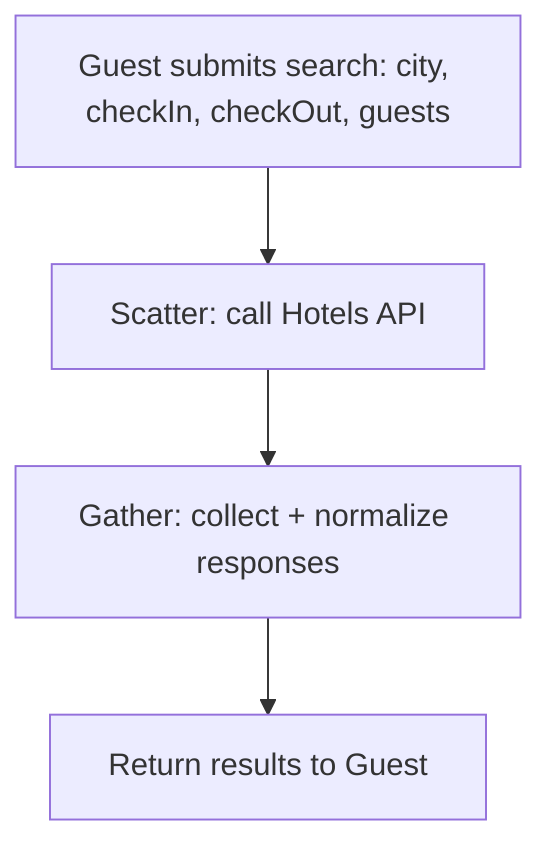
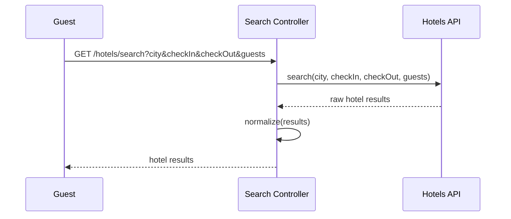
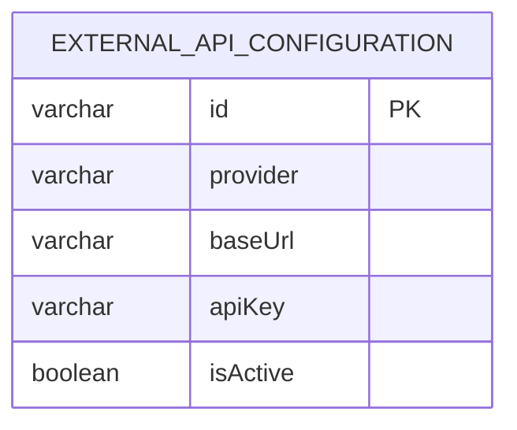

# UC-01 — Search Hotels

**Actor:** Guest
**Team:** Moaz, Radwa

## Flowchart



## Sequence Diagram



## Pseudocode

```
function searchHotels(city, checkIn, checkOut, guests):
    results = HotelsAPI.search(city, checkIn, checkOut, guests)
    normalized = normalize(results)
    return normalized
```

## Entity-Relationship Diagram



`external_api_configuration` holds the connection details (provider, base URL,
API key) the search flow reads to call the Hotels API (`provider = "Hotels"`).
No booking/customer data is read or written by this use case.
