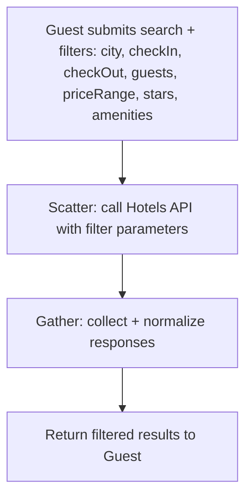
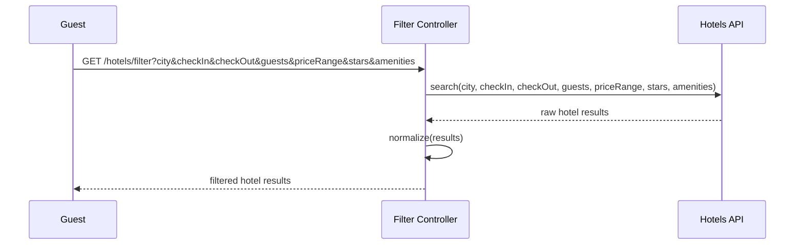
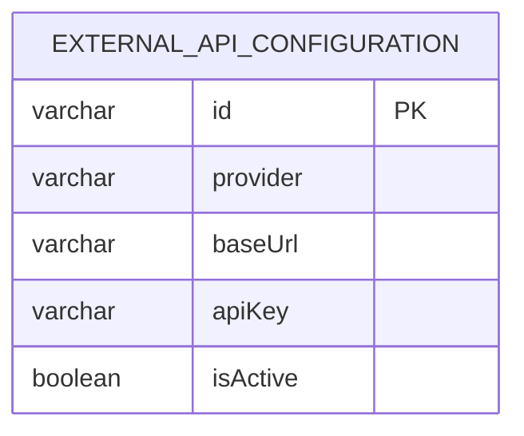

# UC-02 — Filter Hotels

**Actor:** Guest
**Team:** Moaz, Radwa

## Flowchart



## Sequence Diagram



## Pseudocode

```
function filterHotels(city, checkIn, checkOut, guests, filters):
    results = HotelsAPI.search(city, checkIn, checkOut, guests, filters)
    normalized = normalize(results)
    return normalized
```

## Entity-Relationship Diagram



Same as UC-01: `external_api_configuration` (`provider = "Hotels"`) supplies
the connection details for the call. No booking/customer data is read or
written by this use case.
