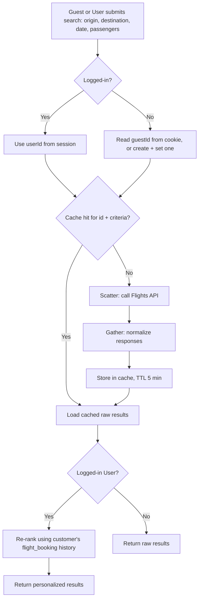
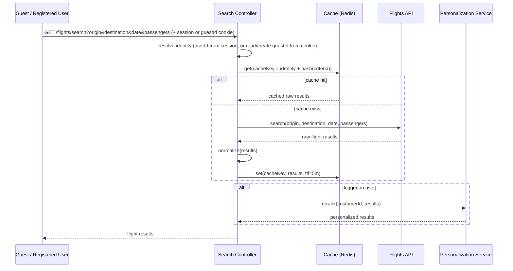
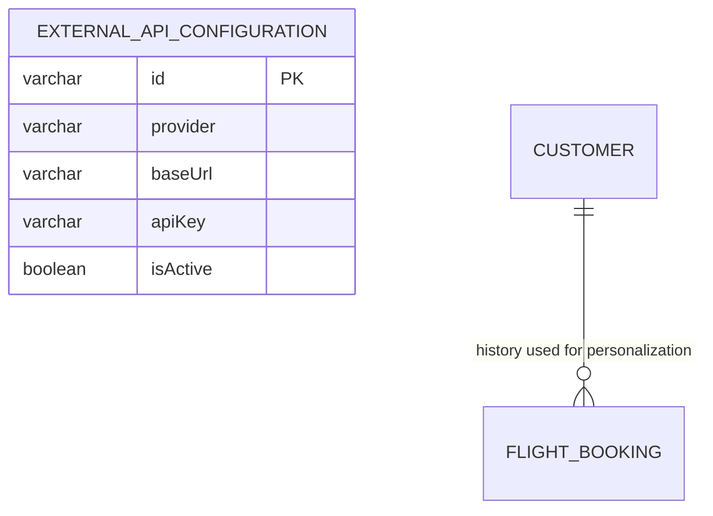

# UC-03 — Search Flights

**Actor:** Guest
**Team:** Hassan, Elzahra

Caching behavior below follows [`caching-design.md`](../caching-design.md)
[مقترح].

## Flowchart



## Sequence Diagram



## Pseudocode

```
function searchFlights(origin, destination, date, passengers, customerId, guestIdCookie):
    identity = customerId is not null ? customerId : (guestIdCookie or generateGuestId())
    cacheKey = buildCacheKey("flight", identity, origin, destination, date, passengers)
    results = cache.get(cacheKey)

    if results is null:
        raw = FlightsAPI.search(origin, destination, date, passengers)
        results = normalize(raw)
        cache.set(cacheKey, results, ttl = 5 minutes)

    if customerId is not null:
        results = PersonalizationService.rerank(customerId, results)

    return results
```

## Entity-Relationship Diagram



`external_api_configuration` holds the connection details for the Flights API
call (`provider = "Flights"`). `flight_booking` is read only for logged-in
users, to re-rank results by the customer's past bookings. The cache itself
(Redis, proposed) is not part of the relational schema. Identity resolution
(session `userId` vs. cookie `guestId`) and the compound cache key are per
the 2026-09-19 update in `caching-design.md`.
