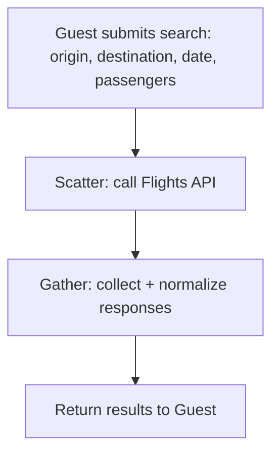
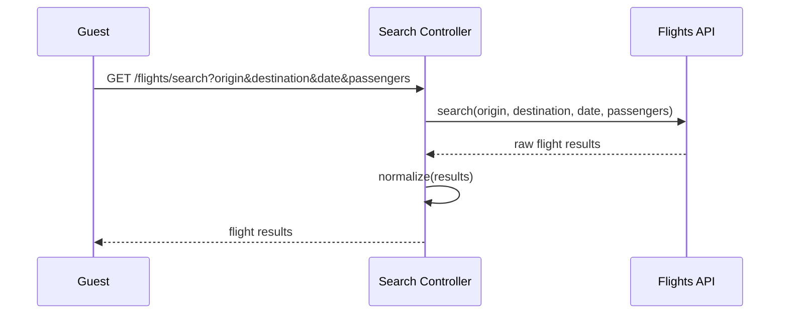
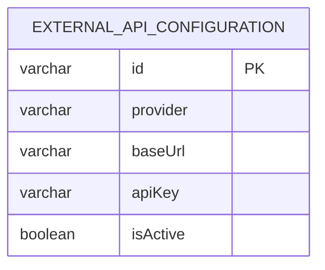

# UC-03 — Search Flights

**Actor:** Guest
**Team:** Hassan, Elzahra

## Flowchart



## Sequence Diagram



## Pseudocode

```
function searchFlights(origin, destination, date, passengers):
    results = FlightsAPI.search(origin, destination, date, passengers)
    normalized = normalize(results)
    return normalized
```

## Entity-Relationship Diagram



`external_api_configuration` holds the connection details (provider, base URL,
API key) the search flow reads to call the Flights API (`provider = "Flights"`).
No booking/customer data is read or written by this use case.
