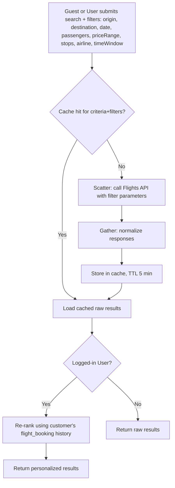
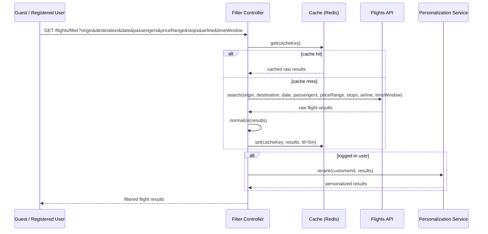
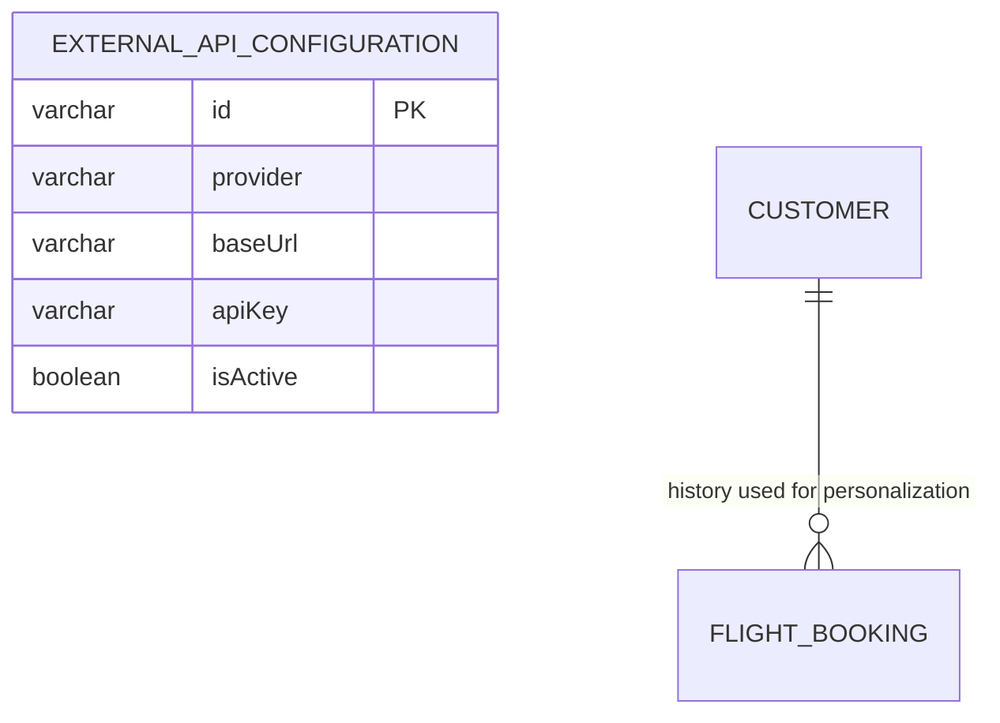

# UC-04 — Filter Flights

**Actor:** Guest
**Team:** Hassan, Elzahra

Caching behavior below follows [`caching-design.md`](../caching-design.md)
[مقترح].

## Flowchart



## Sequence Diagram



## Pseudocode

```
function filterFlights(origin, destination, date, passengers, filters, customerId):
    cacheKey = buildCacheKey("flight", origin, destination, date, passengers, filters)
    results = cache.get(cacheKey)

    if results is null:
        raw = FlightsAPI.search(origin, destination, date, passengers, filters)
        results = normalize(raw)
        cache.set(cacheKey, results, ttl = 5 minutes)

    if customerId is not null:
        results = PersonalizationService.rerank(customerId, results)

    return results
```

## Entity-Relationship Diagram



Same as UC-03: `external_api_configuration` (`provider = "Flights"`) supplies
the connection details for the call, and `flight_booking` is read only for
logged-in users' personalization. The cache itself (Redis, proposed) is not
part of the relational schema.
