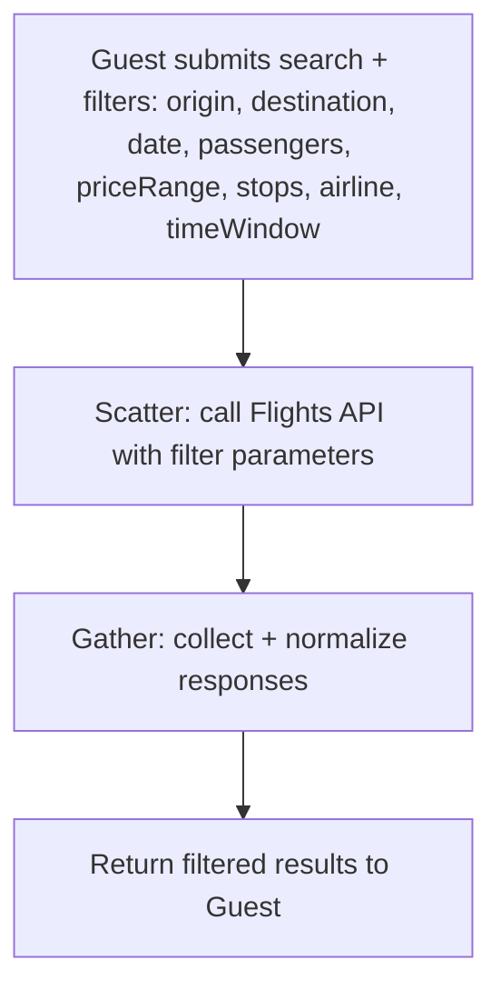
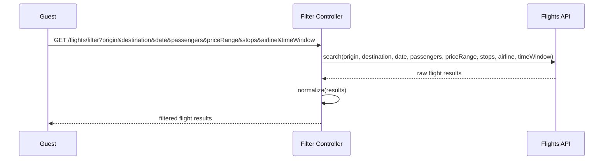
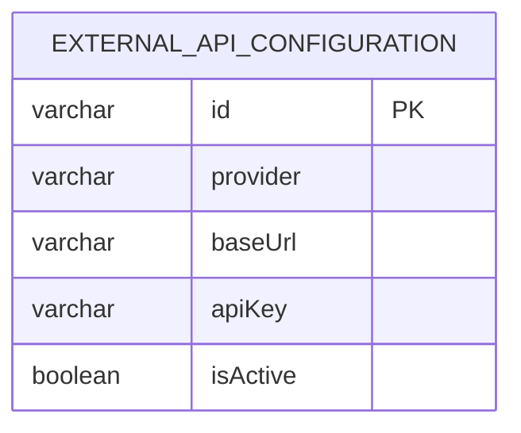

# UC-04 — Filter Flights

**Actor:** Guest
**Team:** Hassan, Elzahra

## Flowchart



## Sequence Diagram



## Pseudocode

```
function filterFlights(origin, destination, date, passengers, filters):
    results = FlightsAPI.search(origin, destination, date, passengers, filters)
    normalized = normalize(results)
    return normalized
```

## Entity-Relationship Diagram



Same as UC-03: `external_api_configuration` (`provider = "Flights"`) supplies
the connection details for the call. No booking/customer data is read or
written by this use case.
