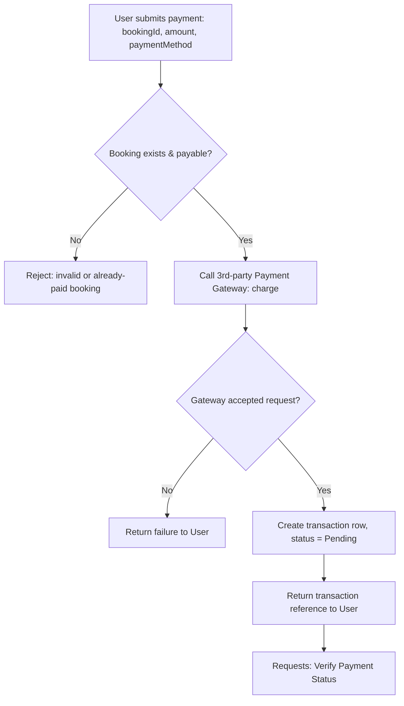
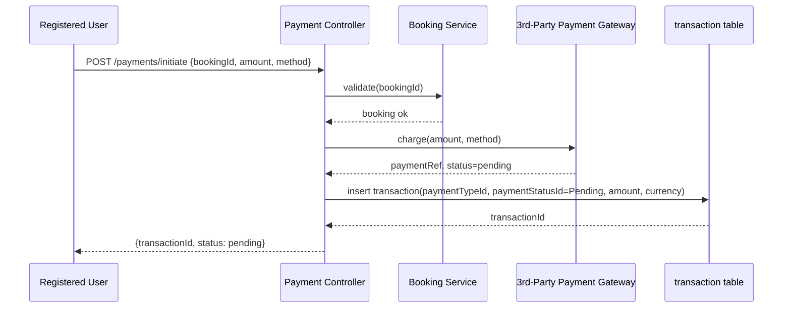
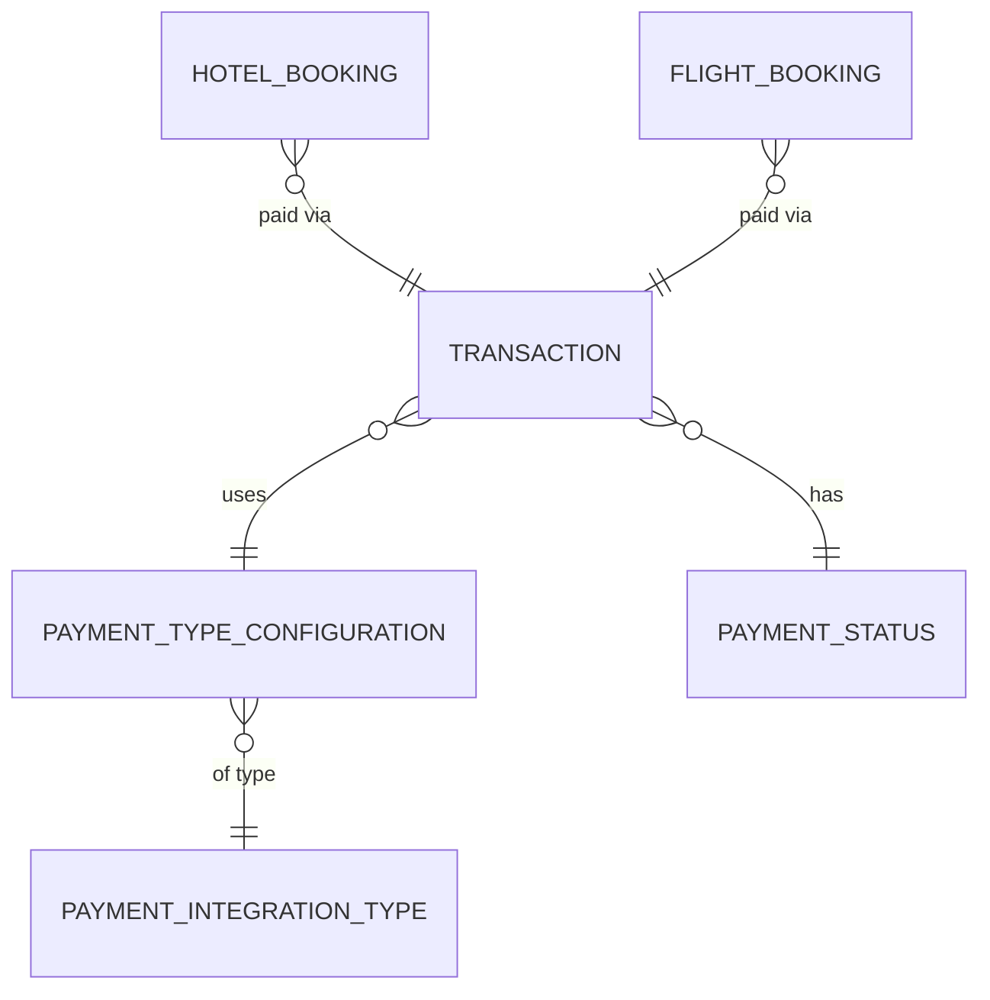

# UC-05 — Initiate Payment

**Actor:** Registered User
**Team:** Sara
**Relates to:** Requests → UC-06 Verify Payment Status

## Flowchart



## Sequence Diagram



## Pseudocode

```
function initiatePayment(bookingId, amount, paymentMethod):
    booking = BookingService.find(bookingId)
    if booking is null or booking.status != "AwaitingPayment":
        throw Error("booking not payable")

    gatewayResponse = PaymentGateway.charge(amount, paymentMethod)
    if not gatewayResponse.accepted:
        return failure(gatewayResponse.reason)

    transaction = TransactionRepo.insert({
        paymentTypeId: paymentMethod.typeId,
        paymentStatusId: STATUS_PENDING,
        amount: amount,
        currency: booking.currency,
        createdAt: now()
    })
    return { transactionId: transaction.id, status: "pending" }
```

## Entity-Relationship Diagram


