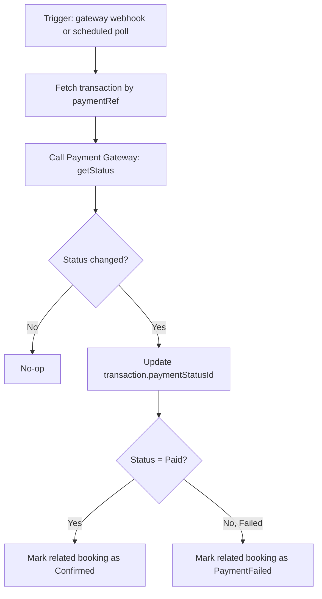
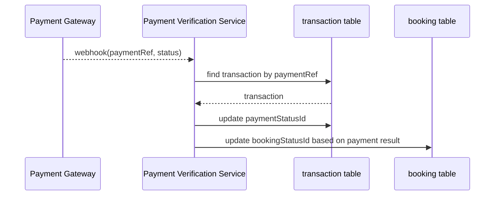
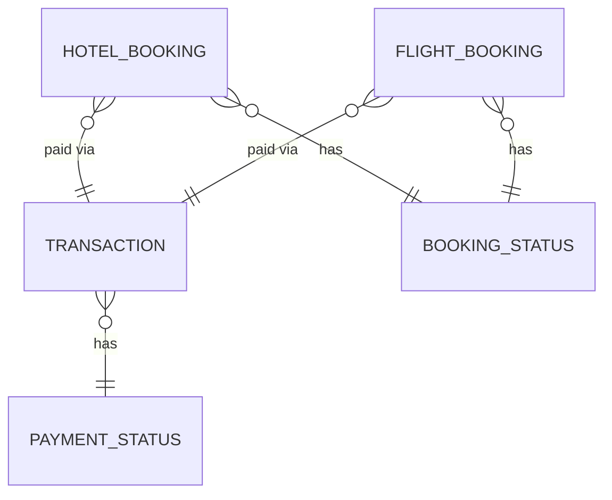

# UC-06 — Verify Payment Status

**Actor:** System
**Team:** Sara
**Relates to:** Requests (triggered by UC-05 Initiate Payment)

## Flowchart



## Sequence Diagram



## Pseudocode

```
function verifyPaymentStatus(paymentRef, reportedStatus):
    transaction = TransactionRepo.findByPaymentRef(paymentRef)
    if reportedStatus == transaction.paymentStatusId:
        return  // no-op, already up to date

    TransactionRepo.update(transaction.id, paymentStatusId = reportedStatus)
    booking = BookingRepo.findByTransactionId(transaction.id)

    if reportedStatus == PAID:
        BookingRepo.update(booking.id, bookingStatusId = CONFIRMED)
    else if reportedStatus == FAILED:
        BookingRepo.update(booking.id, bookingStatusId = PAYMENT_FAILED)
```

## Entity-Relationship Diagram


