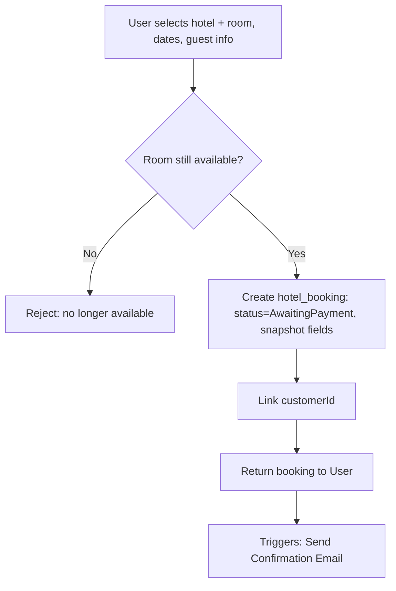
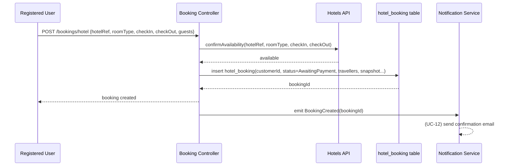
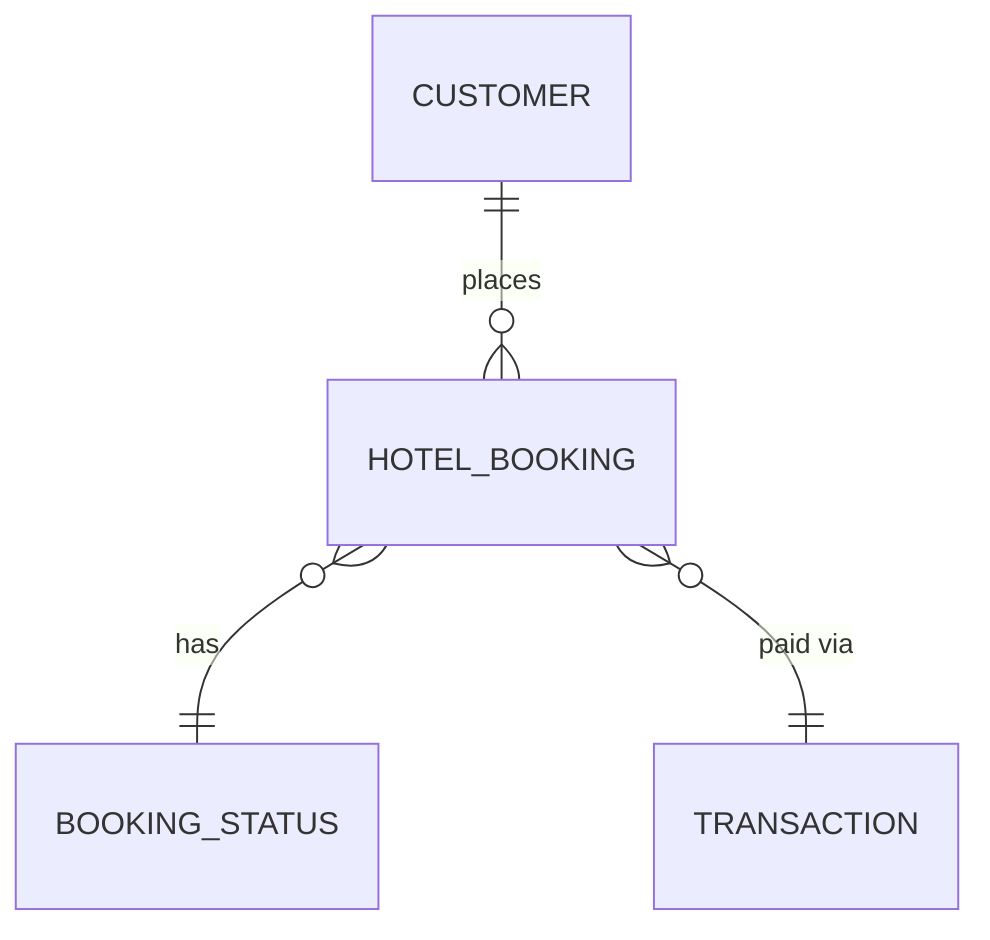

# UC-07 — Book Hotel

**Actor:** Registered User
**Team:** Abdallah, Kamal
**Relates to:** Triggers → UC-12 Send Confirmation Email

## Flowchart



## Sequence Diagram



## Pseudocode

```
function bookHotel(customerId, hotelRef, roomType, checkIn, checkOut, guests, priceSnapshot):
    available = HotelsAPI.confirmAvailability(hotelRef, roomType, checkIn, checkOut)
    if not available:
        throw Error("room no longer available")

    booking = HotelBookingRepo.insert({
        customerId: customerId,
        bookingStatusId: STATUS_AWAITING_PAYMENT,
        externalHotelRef: hotelRef,
        hotelNameSnapshot: fetchHotelName(hotelRef),
        roomType: roomType,
        checkIn: checkIn,
        checkOut: checkOut,
        travellers: guests,   // jsonb — see concepts.md (2026-09-19)
        priceSnapshot: priceSnapshot,
        createdAt: now()
    })

    EventBus.emit("BookingCreated", booking.id)
    return booking
```

## Entity-Relationship Diagram


