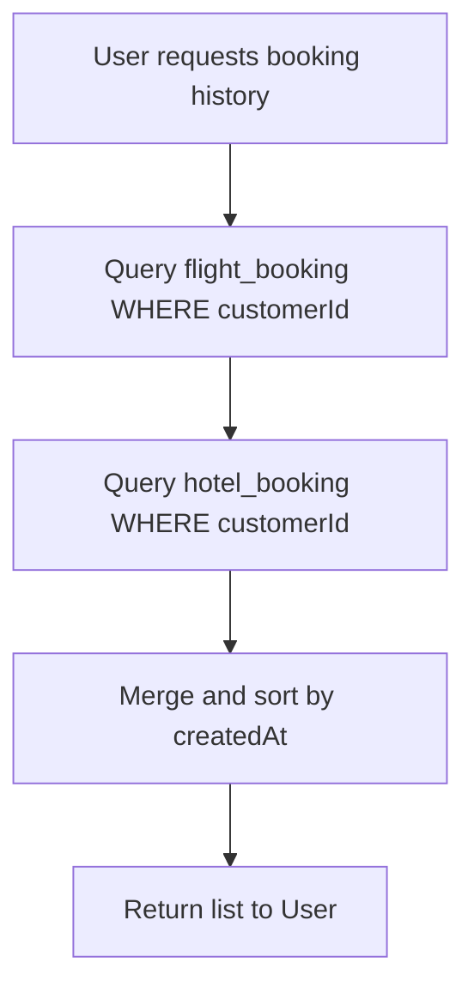
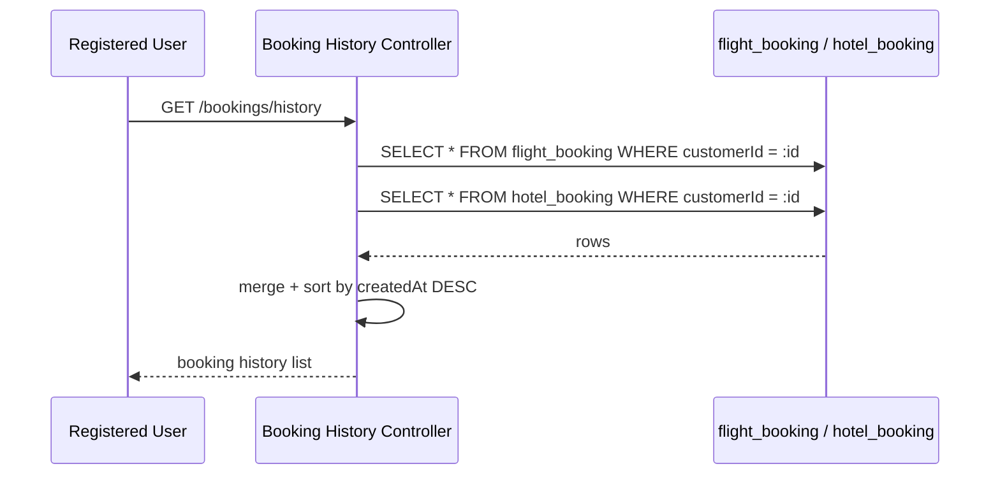
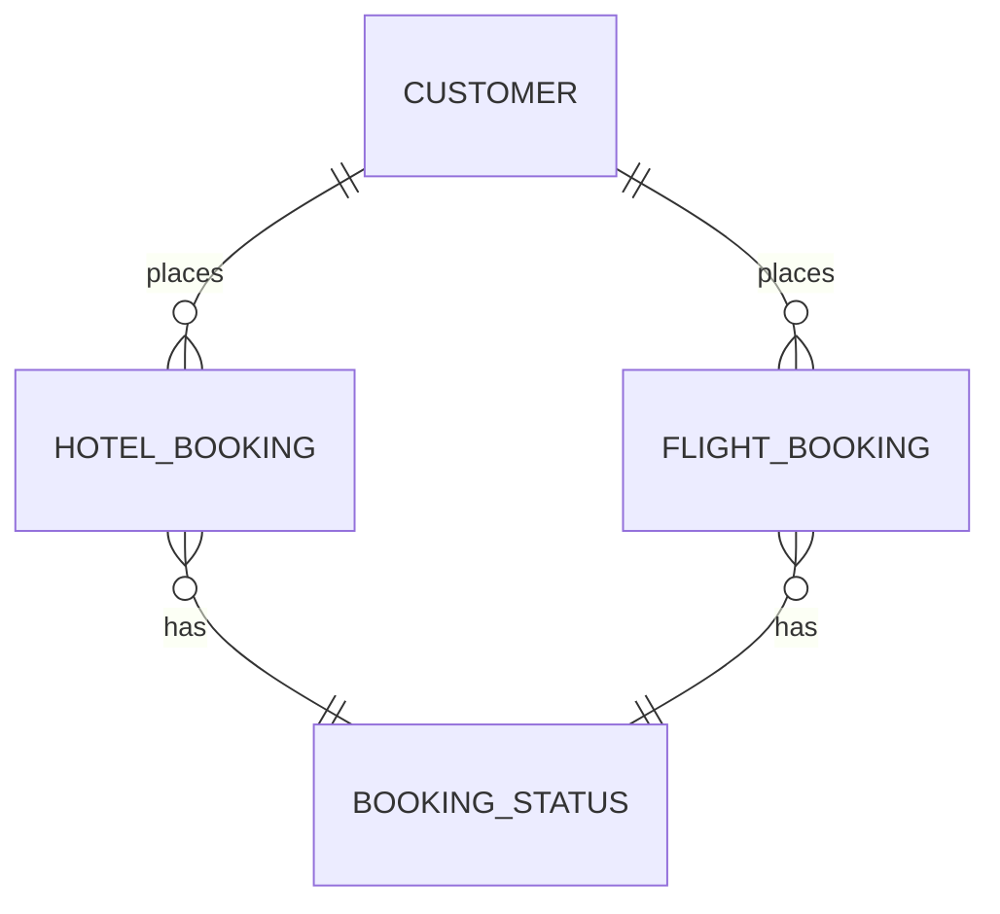

# UC-08 — Retrieve Booking History

**Actor:** Registered User
**Team:** Abdallah, Kamal

## Flowchart



## Sequence Diagram



## Pseudocode

```
function getBookingHistory(customerId):
    flights = FlightBookingRepo.findByCustomer(customerId)
    hotels = HotelBookingRepo.findByCustomer(customerId)
    merged = (flights + hotels).sortByDescending(b => b.createdAt)
    return merged
```

## Entity-Relationship Diagram


