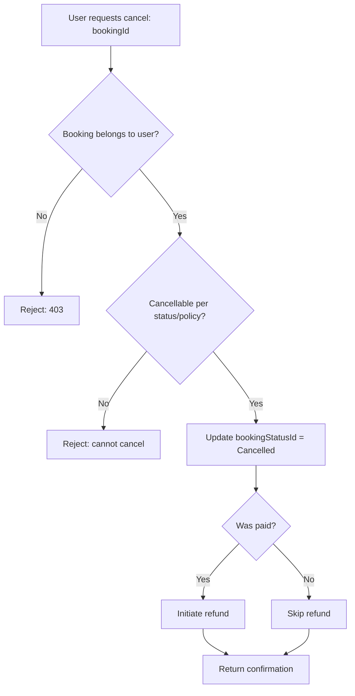
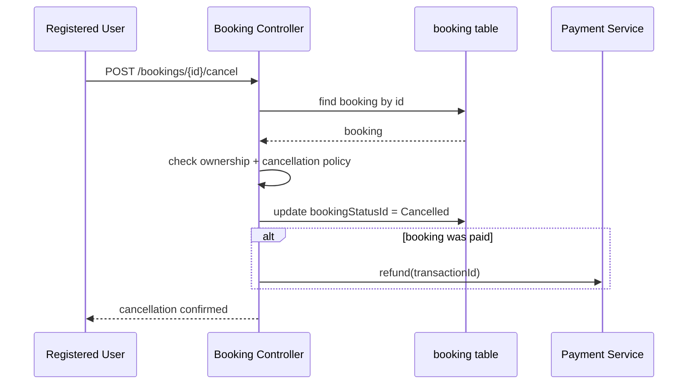
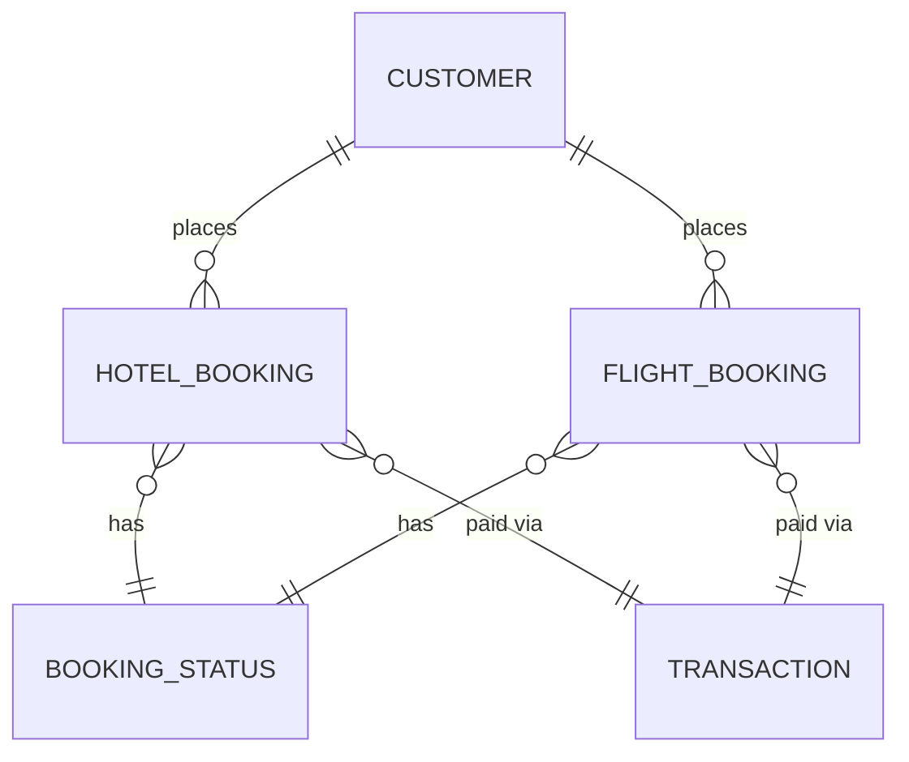

# UC-09 — Cancel Booking

**Actor:** Registered User
**Team:** Sohail, Bassant

## Flowchart



## Sequence Diagram



## Pseudocode

```
function cancelBooking(customerId, bookingId):
    booking = BookingRepo.find(bookingId)
    if booking.customerId != customerId:
        throw Error("forbidden")

    if not isCancellable(booking):
        throw Error("cannot cancel this booking")

    BookingRepo.update(bookingId, bookingStatusId = CANCELLED)

    if booking.transactionId is not null and booking.wasPaid:
        PaymentService.refund(booking.transactionId)   // refund mechanism: open item, see schema.dbml notes

    return confirmation
```

## Entity-Relationship Diagram


