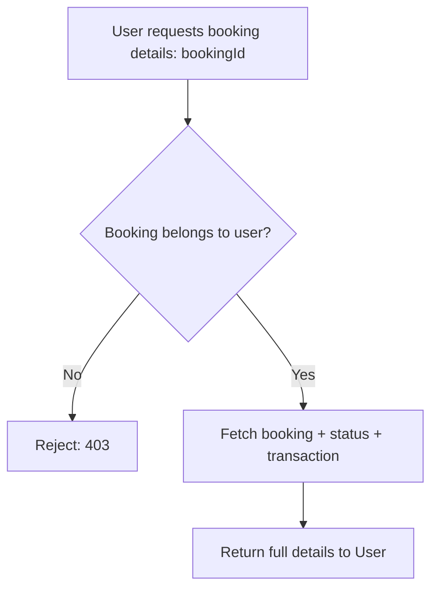
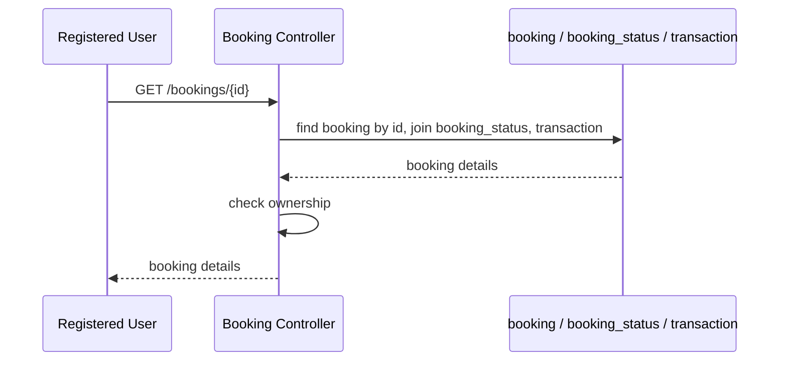
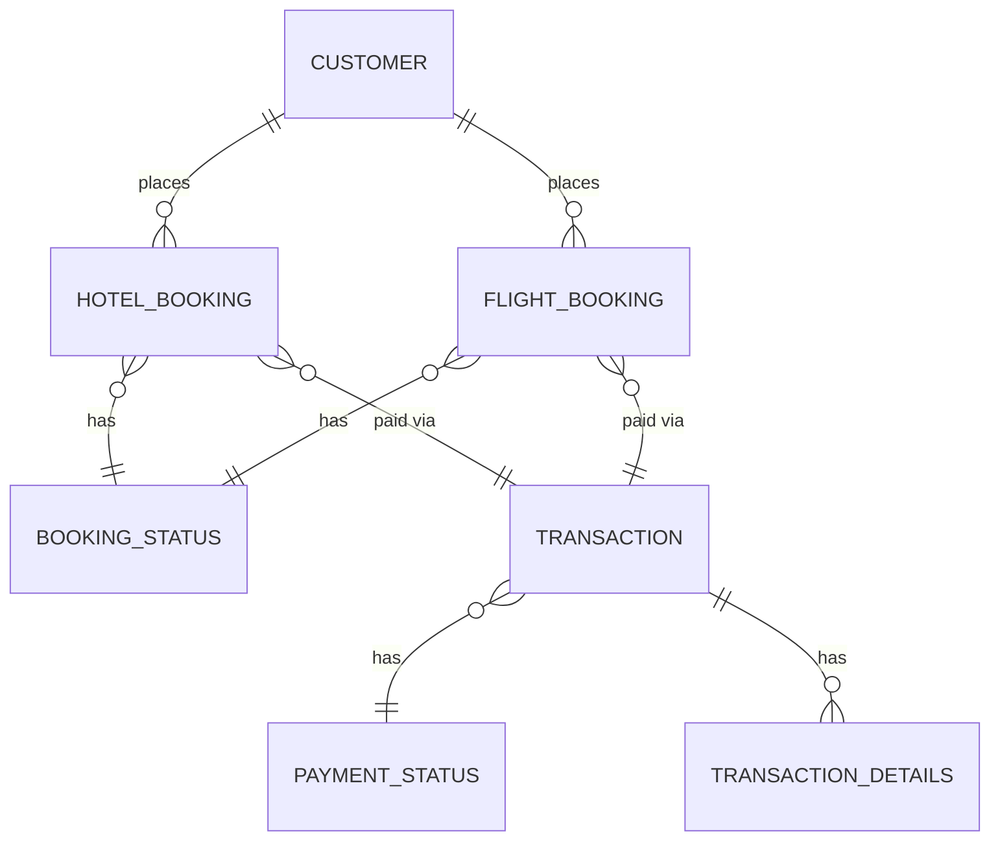

# UC-10 — Retrieve Booking Details

**Actor:** Registered User
**Team:** Sohail, Bassant

## Flowchart



## Sequence Diagram



## Pseudocode

```
function getBookingDetails(customerId, bookingId):
    booking = BookingRepo.findWithDetails(bookingId)   // joins booking_status, transaction
    if booking.customerId != customerId:
        throw Error("forbidden")

    return booking
```

## Entity-Relationship Diagram


