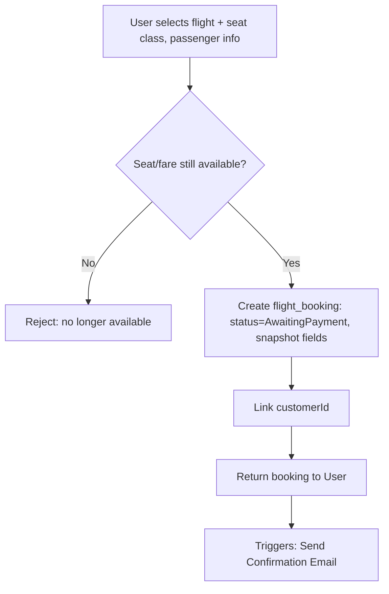
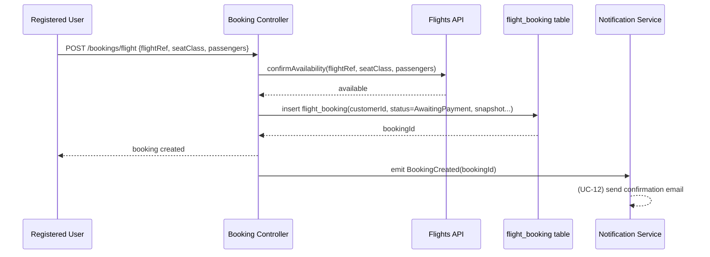
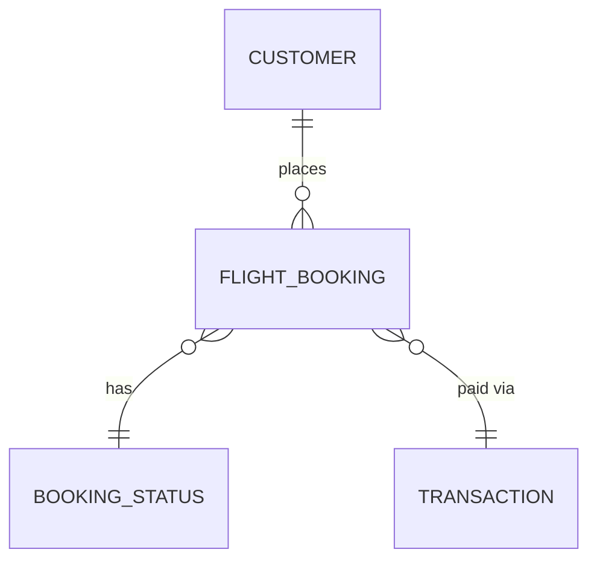

# UC-11 — Book Flight

**Actor:** Registered User
**Team:** Sohail, Bassant
**Relates to:** Triggers → UC-12 Send Confirmation Email

## Flowchart



## Sequence Diagram



## Pseudocode

```
function bookFlight(customerId, flightRef, seatClass, priceSnapshot):
    available = FlightsAPI.confirmAvailability(flightRef, seatClass)
    if not available:
        throw Error("seat/fare no longer available")

    flight = FlightsAPI.getDetails(flightRef)   // for snapshot fields

    booking = FlightBookingRepo.insert({
        customerId: customerId,
        bookingStatusId: STATUS_AWAITING_PAYMENT,
        externalFlightRef: flightRef,
        airline: flight.airline,
        flightNumber: flight.number,
        departureAirport: flight.departureAirport,
        arrivalAirport: flight.arrivalAirport,
        departureAt: flight.departureAt,
        arrivalAt: flight.arrivalAt,
        seatClass: seatClass,
        priceSnapshot: priceSnapshot,
        createdAt: now()
    })

    EventBus.emit("BookingCreated", booking.id)
    return booking
```

## Entity-Relationship Diagram


