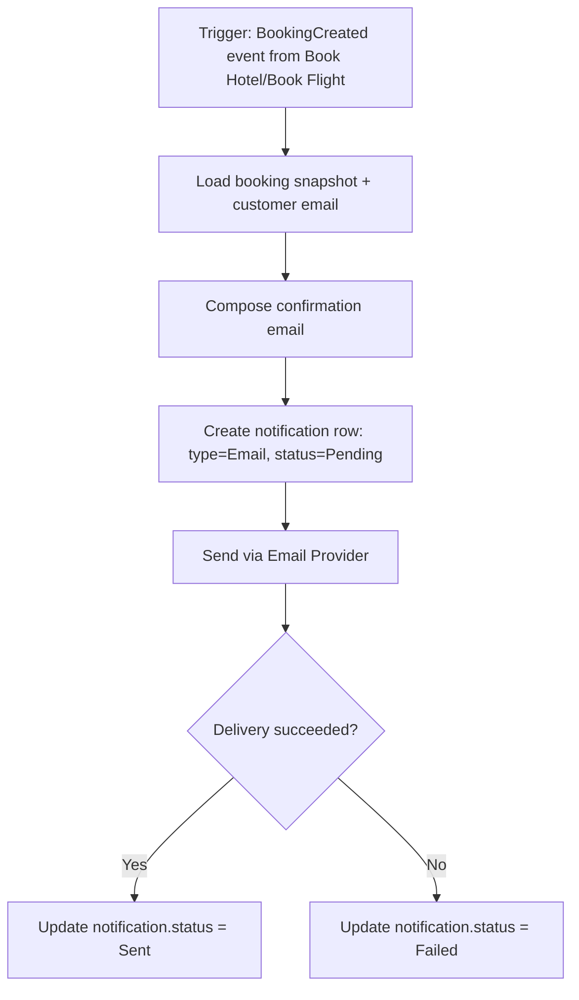
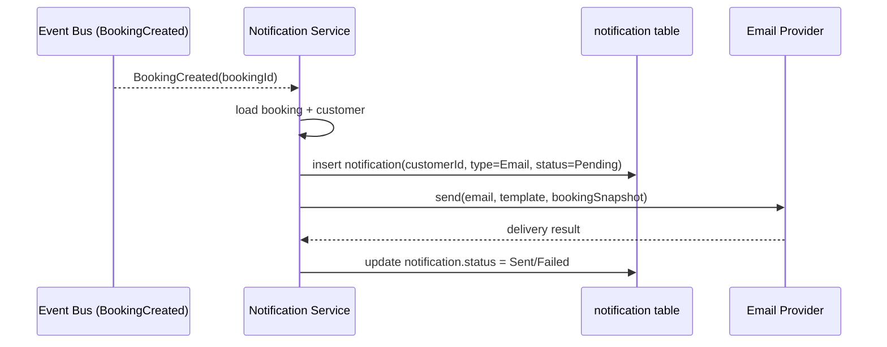
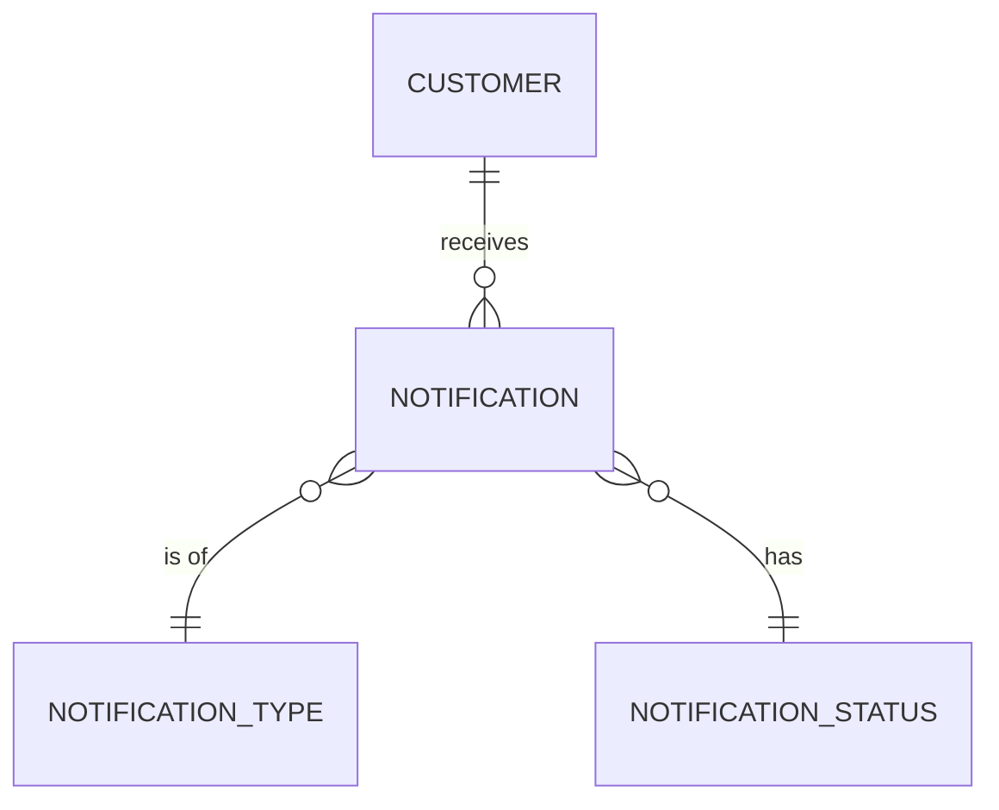

# UC-12 — Send Confirmation Email

**Actor:** System
**Team:** Abdallah, Kamal (from Book Hotel) / Sohail, Bassant (from Book Flight)
**Relates to:** Triggered by UC-07 Book Hotel and UC-11 Book Flight

## Flowchart



## Sequence Diagram



## Pseudocode

```
function sendConfirmationEmail(bookingId):
    booking = BookingRepo.find(bookingId)
    customer = CustomerRepo.find(booking.customerId)

    notification = NotificationRepo.insert({
        customerId: customer.id,
        notificationTypeId: TYPE_EMAIL,
        notificationStatusId: STATUS_PENDING
    })

    result = EmailProvider.send(customer.email, buildTemplate(booking))

    NotificationRepo.update(notification.id,
        notificationStatusId: result.success ? STATUS_SENT : STATUS_FAILED)
```

## Entity-Relationship Diagram



`notification` has no direct foreign key to `hotel_booking` / `flight_booking`
in the current schema — the link between a booking and its confirmation
notification exists only at the application/event layer, not in the database.
