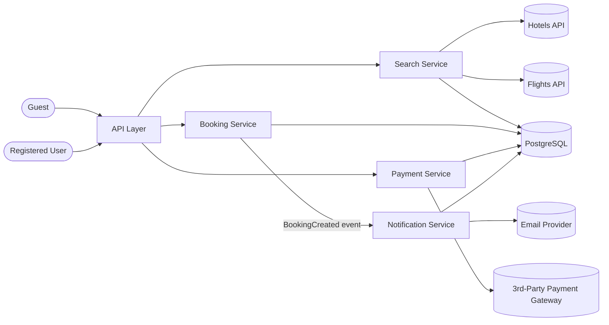

# Basic System Design — Booking

High-level architecture covering the 12 use cases in [`use-cases.md`](use-cases.md).

## Diagram

## Components

| Component | Responsible for | Use Cases |
|---|---|---|
| **Search Service** | Calling Hotels/Flights APIs, reading `external_api_configuration` | UC-01, UC-02, UC-03, UC-04 |
| **Booking Service** | Creating/reading/cancelling bookings | UC-07, UC-08, UC-09, UC-10, UC-11 |
| **Payment Service** | Charging via the 3rd-party gateway, transaction records | UC-05, UC-06 |
| **Notification Service** | Sending confirmation emails, notification records | UC-12 |

## Data flow

- Guest hits **Search Service** directly — no data persisted (see UC-01–UC-04).
- Registered User hits **Booking Service** to create a booking, which writes to
  `hotel_booking` / `flight_booking` and emits a `BookingCreated` event.
- **Notification Service** listens for `BookingCreated` and sends the
  confirmation email (UC-12).
- **Payment Service** is called separately to initiate and verify payment
  (UC-05, UC-06), writing to `transaction`.
- All persistent state lives in one PostgreSQL database (`sources/schema.dbml`).

## Not yet in this diagram

Caching for Search (Guest vs Logged-in) is a separate task — see
`sources/session-2-tasks.png` — and isn't decided yet, so it isn't shown here.
