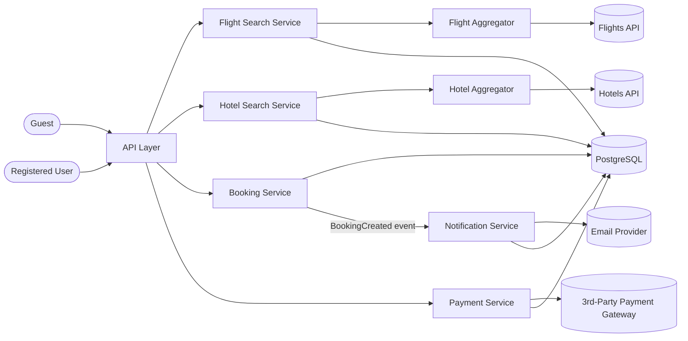

# Basic System Design — Booking

High-level architecture covering the 12 use cases in [`use-cases.md`](use-cases.md).

## Diagram

## Components

| Component | Responsible for | Use Cases |
|---|---|---|
| **Flight Search Service** | Search + caching logic for flights only; delegates all provider communication to **Flight Aggregator** | UC-03, UC-04 |
| **Hotel Search Service** | Search + caching logic for hotels only; delegates all provider communication to **Hotel Aggregator** | UC-01, UC-02 |
| **Flight Aggregator** | Calling the Flights API, reading `external_api_configuration` (provider = Flights), normalizing the response into one shape | UC-03, UC-04 |
| **Hotel Aggregator** | Calling the Hotels API, reading `external_api_configuration` (provider = Hotels), normalizing the response into one shape | UC-01, UC-02 |
| **Booking Service** | Creating/reading/cancelling bookings | UC-07, UC-08, UC-09, UC-10, UC-11 |
| **Payment Service** | Charging via the 3rd-party gateway, transaction records | UC-05, UC-06 |
| **Notification Service** | Sending confirmation emails, notification records | UC-12 |

## Decision: introduce an Aggregator layer per Search Service (2026-08-30)

Each Search Service no longer calls its provider API directly. An
**Aggregator** sits in between:

- **Unified responsibility** — the Search Service owns search + caching only;
  the Aggregator owns provider communication + response normalization.
- **Normalization** — each provider returns data in its own shape; the
  Aggregator normalizes it before the Search Service ever sees it, so a
  provider's API change is contained to its Aggregator, not the search logic.
- **Security/isolation** — the Aggregator isolates external providers from
  the rest of the system; a malformed or unexpected provider response is
  absorbed here, not passed straight into core components.
- **Reuse potential** — this layer is generic enough that it could later be
  exposed as its own internal service other projects reuse, not just
  internal plumbing for this one.

Not part of this decision yet: whether Flight/Hotel Aggregator actually
scatters across *multiple* providers per type, or just wraps one (see
`concepts.md` — Scatter & Gather).

## Decision: separate Flight Search from Hotel Search (2026-08-30)

Originally a single **Search Service** handled both Hotels and Flights.
Split into two independent services instead:

- **Single Responsibility** — each service owns one search domain; a change
  to flight-filtering logic can't accidentally break hotel search.
- **Load isolation** — flight search traffic is typically far higher/burstier
  than hotel search (seasonal spikes). A shared service means a flight-search
  spike slows down hotel search too, even though hotel search isn't the
  cause.
- **Cost efficiency** — scaling resources for the busy service (flights)
  doesn't force scaling the whole combined service, including the part
  (hotels) that didn't need it.

A merged single service is a legitimate choice too, but only as a fast start
under genuinely low, roughly-equal load on both search types — not the
choice here, since flight and hotel search load are expected to diverge.

## Data flow

- Guest hits **Flight Search Service** or **Hotel Search Service** directly
  depending on the use case — no data persisted (see UC-01–UC-04).
- Registered User hits **Booking Service** to create a booking, which writes to
  `hotel_booking` / `flight_booking` and emits a `BookingCreated` event.
- **Notification Service** listens for `BookingCreated` and sends the
  confirmation email (UC-12).
- **Payment Service** is called separately to initiate and verify payment
  (UC-05, UC-06), writing to `transaction`.
- All persistent state lives in one PostgreSQL database (`sources/schema.dbml`).

## Not yet in this diagram

- Caching for Search (Guest vs Logged-in) — now designed separately in
  [`caching-design.md`](caching-design.md), not folded into this diagram yet.
- Which real provider each Aggregator calls — see the candidate in
  [`open-questions.md`](open-questions.md).
