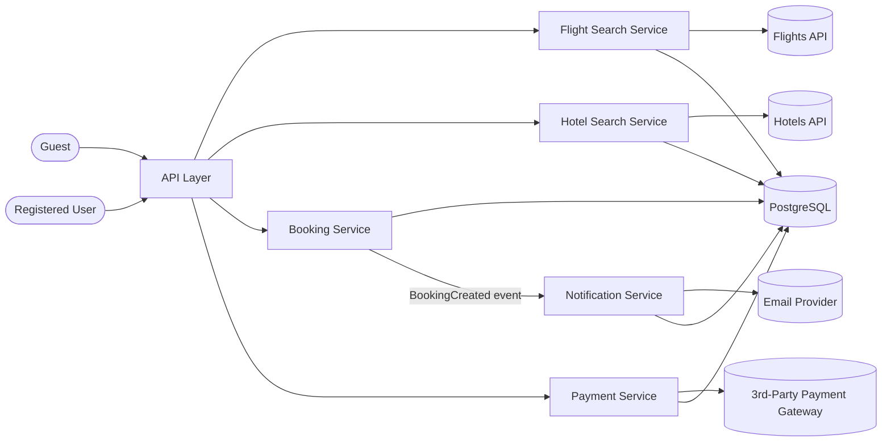

# Basic System Design — Booking

High-level architecture covering the 12 use cases in [`use-cases.md`](use-cases.md).

## Diagram

## Components

| Component | Responsible for | Use Cases |
|---|---|---|
| **Flight Search Service** | Calling the Flights API, reading `external_api_configuration` (provider = Flights) | UC-03, UC-04 |
| **Hotel Search Service** | Calling the Hotels API, reading `external_api_configuration` (provider = Hotels) | UC-01, UC-02 |
| **Booking Service** | Creating/reading/cancelling bookings | UC-07, UC-08, UC-09, UC-10, UC-11 |
| **Payment Service** | Charging via the 3rd-party gateway, transaction records | UC-05, UC-06 |
| **Notification Service** | Sending confirmation emails, notification records | UC-12 |

## Decision: separate Flight Search from Hotel Search (2026-08-30)

Originally a single **Search Service** handled both Hotels and Flights.
Split into two independent services instead:

- **Single Responsibility** — each service owns one search domain; a change
  to flight-filtering logic can't accidentally break hotel search.
- **Load isolation** — flight search traffic is typically far higher/burstier
  than hotel search (seasonal spikes). A shared service means a flight-search
  spike slows down hotel search too, even though hotel search isn't the
  cause.
- **Cost efficiency** — scaling resources for the busy service (flights)
  doesn't force scaling the whole combined service, including the part
  (hotels) that didn't need it.

A merged single service is a legitimate choice too, but only as a fast start
under genuinely low, roughly-equal load on both search types — not the
choice here, since flight and hotel search load are expected to diverge.

## Data flow

- Guest hits **Flight Search Service** or **Hotel Search Service** directly
  depending on the use case — no data persisted (see UC-01–UC-04).
- Registered User hits **Booking Service** to create a booking, which writes to
  `hotel_booking` / `flight_booking` and emits a `BookingCreated` event.
- **Notification Service** listens for `BookingCreated` and sends the
  confirmation email (UC-12).
- **Payment Service** is called separately to initiate and verify payment
  (UC-05, UC-06), writing to `transaction`.
- All persistent state lives in one PostgreSQL database (`sources/schema.dbml`).

## Not yet in this diagram

- Caching for Search (Guest vs Logged-in) — now designed separately in
  [`caching-design.md`](caching-design.md), not folded into this diagram yet.
- An External API Layer / Adapter between each Search Service and its
  provider API (to avoid calling `HotelsAPI`/`FlightsAPI` directly) —
  pending decision, not applied here yet.
